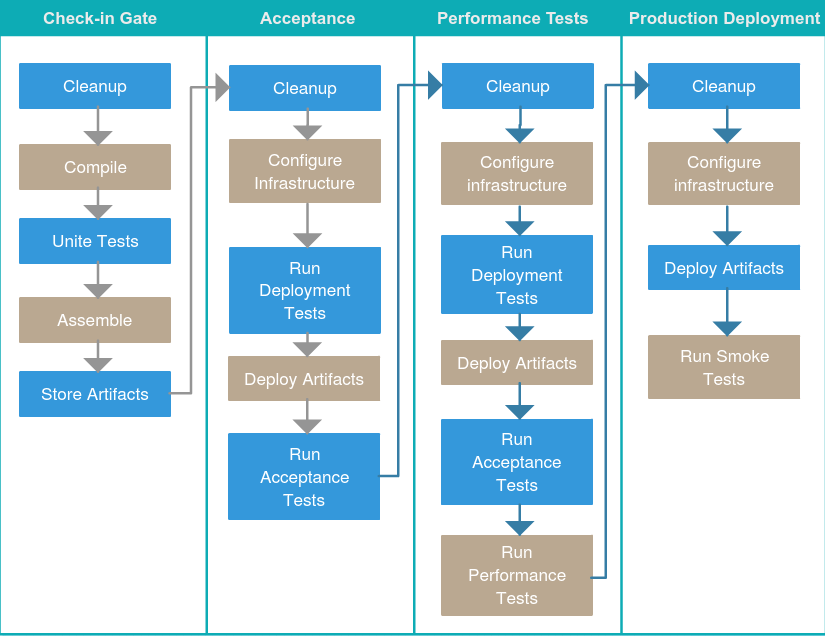
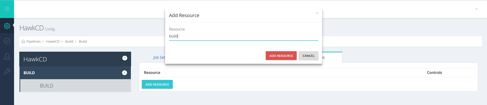
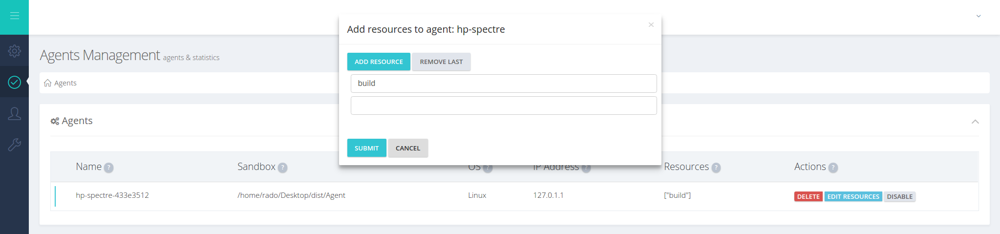

Continuous Delivery Overview
==============================
Continuous Delivery (CD) approach to shipping software has been around for few years now, implemented in teams allows them to produce software in rapid cycles, ensuring that the software can be reliably released at any time. It aims at building, testing, and releasing software faster and more frequently. The approach helps reduce the cost, time, and risk of delivering changes by allowing for more incremental updates to applications in production. HawkCD helps teams to adopt CD practices in the SDLC (Software Development Lifecycle) by giving them the freedom to create CD Pipelines to model their release processes.

Anatomy of a CD pipeline
--------------------------

*The Deployment Pipeline* is a central concept in the CD approach of shipping software. At abstract level, a deployment pipeline is an automated implementation of the software release process for getting software from version control to the market. Usually every change in the software goes through a complex process on its way to being released. The process may involve building the source code, followed by progress of these builds through numerous of stages where the product quality gets assessed. The Deployment Pipeline becomes a central collaboration hub for the software delivery team. Ability to automate the process is crucial for the team productivity.

The CD pipeline breaks down a software delivery process into stages. Each stage is aimed at verifying the software quality from a different angle to validate the functionality and prevent errors from affecting users. The CD pipeline provides feedback to the team and visibility into the flow of changes to everyone involved in the delivery

There is no such thing as _Standard Deployment Pipeline_, however a typical CD pipeline will include some, or all of the following stages: Check-in, Acceptance, Perforence Tests



Server Objects & Concepts
=========================
The following section represents a deep dive into the HawkCD Server concepts, components and objects.

A task is an action that is performed on a server/machine or inside container where HawkCD agent is installed. HawkCD offers 4 types of tasks

Exec
--------------
### Overview

The "Exec" task is the most universal type of tasks HawkCD offers. It allows you to do just anything you can think of on a given server where the task is executed on. You can run script, e.g. PowerShell, Shell, execute commands etc.

### How does it work?
The exec task contains the following attributes: ``Command``, ``Arguments`` and ``Working Dir``.

* ``Command`` - executable name to run, usually for Linux -``/bin/bash``, for Windows ``cmd``
* ``Arguments`` - arguments to be passed to the executable e.g. Linux - ``-c cp -r dir dir1`` , Windows ``/c echo %PAHT%``
* ``Working Dir `` - the directory, the process to be run in

Example commands:

```bash

  #copy all files

  /bin/bash -c cp -r dir1/  dir2

```
The above command runs on Linux based systems the ``bash`` executable and passes the ``cp`` command with arguments to it

  <div class="admonition note">
  <p class="admonition-title">Note</p>
  <p>
  You can think of HawkCD Exec Task as universal command executor. In fact it can run any command via ``cmd`` or ``/bin/bash``, ``/bin/sh`` as long as it's in the environment path (system | user) on the system, otherwise the ``Command`` value must be direct path to targeted executable on the system
  </p>
  </div>


### Configuration Options

The ``Exec Task`` provides two configuration options:

* ``Run If Condition``
* ``Ignore Errors ``


 ``Run If Condition`` - runs under three different scenarios: ``Passed``, ``Failed`` and ``Any``.
 If option ``Passed`` (default) is chosen, the execution of the current task will be continued only in case the previous task completed successfully - ``Passed``
 If the option ``Failed`` is chosen it will be run only in case the previous task is marked as ``Failed``.
 A task set to ``Any`` will always run, regardless of previous task status (``Passed`` | ``Failed``).

 ``Ignore Errors`` - Ignore errors, if there are any, sets task status to ``Passed``.

 <div class="admonition warning">
 <p class="admonition-title">WARNING</p>
 <p>
 Be aware that [Task](#task) marked with *FAILED* will run only in case the previous task exits with failed code.
 </p>
 </div>

### Exec Tasks Scenarios

* [Add ](/configuration/#add-delete-exec-task)
* [Delete ](/configuration/#delete-exec-task)
* [Configure](/configuration/#configure-exec-task)


Fetch Material
---------------

###Overview

The ``Fetch Material`` task allows you to fetch already defined materials with the system. At the moment ``HawkCD`` supports only materials of type ``git`` meaning that you can define and fetch materials of type git only as input to your pipelines. Future versions it may support other types e.g. ``TFVC``, ``SVN`` etc. A common use case is when you need to build your source code but before doing it you need to fetch it on an agent first.

### How does it work?

### Configuration Options


Upload Artifacts
----------------

### Overview
The Upload Artifacts task respectively allows you to upload build artifacts to the server. A common use case is when you compile a source code to store the build output to the server via using the Upload Artifacts task. then using Fetch Artifacts to deploy it on appropriate agent.

### How does it works?
``Agent`` deploys specified artifact to the ``Server``.<br />
To upload artifacts to the server, two attributes must be specified: ``Source`` and ``Destination``. <br />

``Source``  - is ``required`` to be specified in order artifact to be uploaded. It may be previous built or any other artifact
placed in the agents work directory. <br />
<br />``Destination``  -  The ``Artifacts`` folder on the ``Server``,  <br />

### Configuration Options

The ``Upload Artifact`` task provides one configuration option:

* ``Run If Condition``

 ``Run If Condition`` - runs under three different scenarios: ``Passed``, ``Failed`` and ``Any``.
 If option ``Passed`` (default) is chosen, the execution of the current task will be continued only in case the previous task completed successfully - ``Passed``
 If the option ``Failed`` is chosen it will be run only in case the previous task is marked as ``Failed``.
 A task set to ``Any`` will always run, regardless of previous task status (``Passed`` | ``Failed``).


Fetch Artifacts
---------------

### Overview
The ``Fetch Artifacts`` task allows users to download artifacts from the server repository into a ``HawkCD`` agent sandbox.

### How does it work?

### Configuration options


Job
-----

### Overview

A ``job`` consists of multiple ``tasks``, each of which executes in order. If ``task`` inside a ``job`` fails, then the ``job`` is considered failed, and unless specified otherwise, the rest of the tasks in the ``job`` will not be run.

### How does it work?

Unlike ``Tasks`` and ``Stages``, which are always executed in sequence, ``Jobs`` are executed in ``parallel`` among Agent's grid.
``Resources``, also called ``tags``, can be used to route jobs to specific agents. When job doesn't have a concrete resource assigned, it considers all available agents registered with the server for execution.

While one Job is executing, another may wait for the same [Agent](#agent) or for an eligible [Agent](#agent) which may not even be registered with the server. In this scenario, the Pipeline it belongs to is set to status ``AWAITING`` and will resume execution as soon as an eligible [Agent](#agent) becomes registered and enabled with HawkCD.

Job without resources can be executed from all agents. Job with a specific
[resource](#resource) may be executed only from an [agent](#agent) with the same resource assigned. Also a``Job`` may have more than one resource assigned.

Jobs may contain [Environment Variables](#environment-variables). They become available during task execution and can be read from task by using percentage symbol notation e.g. ``%EnvironmentVariable%``

To learn more about  how environment variables work, check the [Environment Variables](#environment-variables) section.

### Configuration Options
``Job`` may be created first and decided to be configured later. Its configuration options include updating job name, adding, editing or deleting a task list.
Overriding environment variable, adding resource

* [add/delete job](/configuration/#add-delete-job)
* [configure job](/configuration/#configure-job)

Stage
-------
A ``Stage`` can be thought as a container for ``Jobs``. While ``Jobs`` are run in parallel, ``Stages`` are always run in sequence. If a ``Job`` from particular stage fails, then the Stage is considered failed as well.

However, since Jobs are independent of each other, all other Jobs in the Stage will also be run. Stages that belong to a certain pipeline are always run in sequence.

Pipeline
---------

### Overview
A ``Pipeline`` consists of multiple Stages, each of which is run in order. If a Stage fails, then the Pipeline is considered failed and the rest of the stages will not be run. The ``Pipeline`` server object allows crafting the entire application release process

###How does it work?

We briefly showed you the <a href="#anatomy-of-a-cd-pipeline"> Anatomy of a Pipeline </a>.<br />
All of your Pipelines will have a set of Stages which will have a set of Jobs which will have a set of Tasks. Task are what gets things done.

There are four different types of tasks in ``HawkCD`` - <a href="#">Exec</a>,<a href="#"> Fetch Artifact</a>, <a href="#">Fetch Material</a> and <a href="#">Upload Artifact</a>. In order your Pipeline run to be set to
<a href="#statuses">status </a> PASSED, each of your task's action must complete successfully, unless the task is marked otherwise with <a href="#"> Ignore Errors</a> option. <br />

If all tasks in a certain Job complete successfully, the Job will be set to PASSED, all jobs must be with status PASSED for a Stage to pass. All Stages must pass for your Pipeline
run to complete successfully. If a Task fail the Job in which is defined will fail, respectively the whole Pipeline will be set to FAILED. <br /> <br />

<div class="admonition note">
<p class="admonition-title">Note</p>
<p>
All Stages and Tasks runs in sequence, except Jobs. Execution starts in order, if one Task, Job, or Stage fails the next Task/Job/Stage will not run.
The Pipeline will be set to FAILED.
</p>
</div>

### Configuration Options
In HawkCD you can manage your Pipeline very easily.<br /><br />
You can <a href="/configuration/#configure-pipeline">update pipeline name</a> or select <a href="#automatic-pipeline-scheduling"> Automatic pipeline scheduling</a>. You can <a href="#"> add Stage </a>, <a href="#"> add Job </a> or <a href="#">
add Task </a> to already created Pipeline. Delete each one of them is also pretty straightforward, with just one click. Each Pipeline, Stage, Job or Task can be configured in details.<br /> <br />


Click <a href="/configuration/#configure-pipeline"> Configure Pipeline </a> to see how to configure your  <a href="#environment-variables"> Environment Variables</a> or how to add <a href="#resource"> Resources. </a>

<br />
<br />
<br />

Here is a list of options you can do. <br />
> <a href ="/configuration#create-a-pipeline"> Add new Pipeline </a> <br />
<a href ="/configuration/#configure-pipeline"> Configure Pipeline </a> <br />
<a href ="#"> Delete Pipeline </a>

<br />

Pipeline Groups
---------------

#### Overview
#### How it works?
#### Configuration Options

Materials
---------

#### Overview
#### How it works?
#### Configuration Options

Resource | Tags
---------------

Resources are used to route jobs to agents. A common use case is when you have multiple agents installed on various server environments and you want to specify a certain job to be executed on concrete agent. Imagine you have a build server and application server,  of course you don't want when you kick off a "Build Stage" -> "Build job" to be routed to the Application Server, so applying a resource to the job, as well as to the agent would allow HawkCD to correctly assign jobs only to the matching agents

The resources assigned to an agent and job must match 100% to get jobs routed correctly

> Assign resource to a job



> Assign resource to an agent



Environment Variables
---------------------

###Overview

###How does it work?

Agent
------

### Overview

``HawkCD`` Agents are the workers that execute ``Jobs/Tasks``. All Tasks configured in the system run on ``HawkCD`` Agents. A common workflow is: The ``HawkCD`` Server checks for changes in Materials and when a change is detected a Pipeline gets triggered, the corresponding Jobs are assigned to eligible Agents and all tasks of theirs are executed.

###How does it work?
In the agent ``install dir`` a folder called ``Pipelines``, referred also as agent ``sandbox`` is created to store data for each pipeline. If we execute jobs from two pipelines on a specific agent we would have the following directory structure  ``InstallDir/Pipelines/Pipeline1`` and ``InstallDir/Pipelines/Pipeline2``

When an agent registers for first time with the server it is ``disabled`` meaning that, the server knows about it but unless it's enabled explicitly by the server Admin, jobs will be not be distributed to it  


#### Agent Statuses

* Idle - ready to accept jobs
* Running - executing job
* Disconnected - used to be connected but no longer available with the server


Security
--------
### Overview
The server has the notion for ``scope`` and ``permission type``. ``Scope`` represents a certain level from the server where specific rights can be applied. On the other hand, ``permission types`` define rights - what a user can do in concrete ``scope``. Combining both concepts (``scope`` & ``permission type``) provides a flexible authorization model.

#### Permission Scopes

* ``Server`` - global server scope
* ``Pipeline group`` - pipeline group level
* ``Pipeline`` - pipeline level scope

#### Permission Types

* ``Viewer``  - a user can only view a given resource and its child resources
* ``Operator`` - a user can view and operate (run, re-run, pause, stop, etc.) a given resource (e.g. Pipeline & Stage) and its child resources
* ``Admin``

####Groups

A ``group`` is a set of claims (scope + permissions) that are grouped together. A ``group`` would ease the authorization management across groups of people. E.g. if we have 3 teams - dev, qa & ops, rather than assigning permissions individually to each team member, we would create a group and add scope and permissions to it, then add the members to the group, so that they inherit all of the ``group’s`` permissions.

#### Permission Inheritance

If a user is assigned a ``pipeline group`` scope and an ``admin permission`` type that would mean that all resources that are children of the current ``pipeline group`` (scope) e.g. one or more pipelines, will obey the permission assigned to their parent - pipeline group.

#### Overriding Permissions

This is the case when we want to give a user permissions at a given scope e.g. "pipeline group", however we need to either restrict or broaden the rights to one or more child resources, e.g. Pipelines.
Given is a Pipeline group named "Dev pipelines" and we want to have one of our teams to have view rights for the group. Combining the Pipeline Group scope and the view permission type would allow anyone of the team to see all pipelines. However, if we want the Development Lead of the team to be able to administer one or more pipelines from the group, but not all of them, we would assign in addition to its view rights inherited from the pipeline group scope, a pipeline scope with admin permission for a concrete pipelines that he needs administration rights for. In fact we'll override the inherited rights he received as part of the Pipeline group scope.
