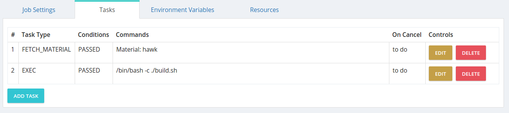

##Concepts

### Continuous Delivery Overview

Continuous Delivery (CD) approach to shipping software has been around for few years now, implemented in teams allows them to produce software in rapid cycles, ensuring that the software can be reliably released at any time. It aims at building, testing, and releasing software faster and more frequently. The approach helps reduce the cost, time, and risk of delivering changes by allowing for more incremental updates to applications in production. HawkCD helps teams to adopt CD practices in the SDLC (Software Development Lifecycle) by giving them the freedom to create CD Pipelines to model their release processes.

### Anatomy of a CD pipeline

*The Deployment Pipeline* is a central concept in the CD approach of shipping software. At abstract level, a deployment pipeline is an automated implementation of the software release process for getting software from version control to the market. Usually every change in the software goes through a complex process on its way to being released. The process may involve building the source code, followed by progress of these builds through numerous of stages where the product quality gets assessed. The Deployment Pipeline becomes a central collaboration hub for the software delivery team. Ability to automate the process is crucial for the team productivity.

The CD pipeline breaks down a software delivery process into stages. Each stage is aimed at verifying the software quality from a different angle to validate the functionality and prevent errors from affecting users. The CD pipeline provides feedback to the team and visibility into the flow of changes to everyone involved in the delivery

There is no such thing as _Standard Deployment Pipeline_, however a typical CD pipeline will include some, or all of the following stages: Check-in, Acceptance, Perforence Tests

Eg. CD process

### Tasks

A task is an action that is performed on a server/machine or a container where the HawkCD agent is installed. HawkCD offers 4 types of tasks

>Exec Task

The "Exec" task is the most universal type of tasks, it allows you to do just anything you can think of on a given server where the task is executed on. You can run script, e.g. PowerShell, Shell, execute commands etc.

>Fetch Material

The Fetch Material task allows you to fetch already defined materials w/ the system. A common use case is when you need to build your source code but before doing it you need to fetch it on the agent, so you would arrange your job task like this:

>Fetch artifacts

The Fetch Artifacts tasks allows users to carry on artifacts - build output, tests results to various stages

>Upload Artifacts

The Upload Artifacts task respectively allows you to upload build artifacts to the server. A common use case is when you compile a source code to store the build output to the server via using the Upload Artifacts task. then using Fetch Artifacts to deploy it on appropriate agent

### Job

A job consists of multiple Tasks, each of which will be run in order. If a Task in a Job fails, then the Job is considered failed, and unless specified otherwise, the rest of the Tasks in the Job will not be run. It's critical to note here that jobs are executed in parallel on the server while task of a job are always executed in sequence

### Stage

A Stage consists of multiple jobs, each of which can run independently of the others. If a Job fails, then the Stage is considered failed. However, since Jobs are independent of each other, all other Jobs in the Stage will also be run. Stages that belong to a certain pipeline are always run in sequence.

### Pipeline

A Pipeline consists of multiple Stages, each of which will be run in order. If a Stage fails, then the Pipeline is considered failed and the rest of the stages will not be started. A pipeline can be thought also as a "process"

### Resource

Resources are used to route jobs to agents. A common use case is when you have multiple agents installed on various server environments and you want to specify a certain job to be executed on concrete agent. Imagine you have a build server and application server,  of course you don't want when you kick off a "Build Stage" -> "Build job" to be routed to the Application Server, so applying a resource to the job, as well as to the agent would allow HawkCD to correctly assign jobs only to the matching agents

The resources assigned to an agent and job must match 100% to get jobs routed correctly

> Assign resource to a job

> Assign resource to an agent

### Agent

HawkCD Agents are the workers that execute the Jobs/Tasks. All Tasks configured in the system run on HawkCD Agents. A common workflow is:  The HawkCD Server check for changes in Materials and when a change is detected and a Pipeline gets triggered, the corresponding Jobs are assigned to the Agents, for them to execute the Tasks.

Agents pick up Jobs which are assigned to them, execute the Tasks in the Job and report the status of the Job to the Server. Then, the Server collects all the information from the different Jobs and then decides on the status of the Stage.

Agents and Jobs can be enhanced with "Resources". Resources are free-form tags, that help HawkCD to decides which Agents are capable of receiving specific Jobs. The resources can be thought of as the Agent broadcasting its capabilities. Resources are defined by administrators and can mean anything the administrators want them to mean.

### Security

The server has the notion for scope and permission types. A scope represents a certain level from the server where specific rights can be applied. On the other hand, permission types define the rights - what a user can do from a specific scope. Combining both concepts (scope & permission types) provides a flexible authorization model.
> Permission Scopes

* Server - global server scope
* Pipeline group - pipeline group level
* Pipeline - pipeline level scope

> Permission Types

* Viewer  - a user can only view a given resource and its child resources
* Operator - a user can view and operate (run, re-run, pause, stop, etc.) a given resource (e.g. Pipeline & Stage) and its child resources
* Admin

>Groups

A group is a set of claims (scope + permissions) that are grouped together. A group would ease the authorization management across groups of people. E.g. if we have 3 teams dev, qa & ops, rather than assigning permissions individually to each team member, we would create a group and add scope and permissions to it, then add the members to the group, so that they inherit all of the group’s permissions.

> Permission Inheritance

If a user is assigned a pipeline group scope and an admin permission type that would mean that all resources that are children of the current pipeline group (scope) e.g. one or more pipelines, will obey the permission assigned to their parent - pipeline group.

> Overriding Permissions

This is the case when we want to give a user permissions at a given scope e.g. "pipeline group", however we need to either restrict or broaden the rights to one or more child resources, e.g. Pipelines.
Given is a Pipeline group named "Dev pipelines" and we want to have one of our teams to have view rights for the group. Combining the Pipeline Group scope and the view permission type would allow anyone of the team to see all pipelines. However, if we want the Development Lead of the team to be able to administer one or more pipelines from the group, but not all of them, we would assign in addition to its view rights inherited from the pipeline group scope, a pipeline scope with admin permission for a concrete pipelines that he needs administration rights for. In fact we'll override the inherited rights he received as part of the Pipeline group scope.
