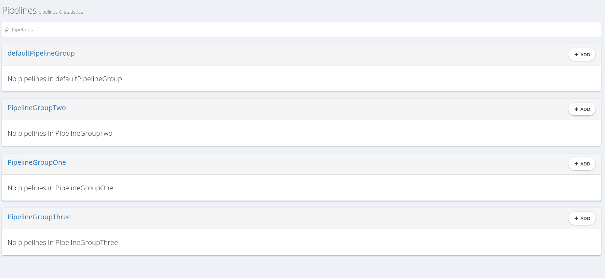
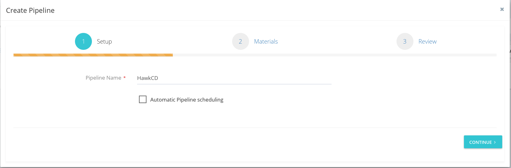
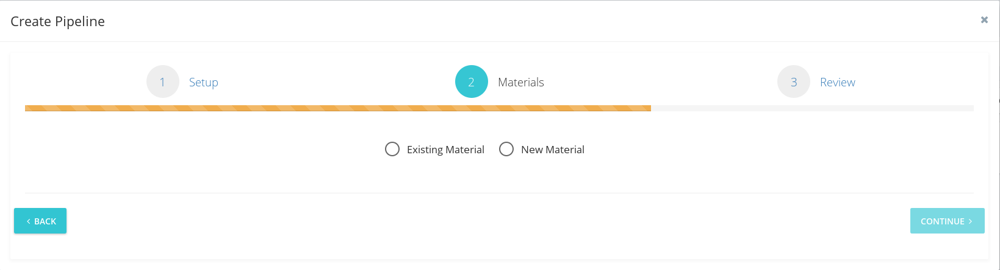
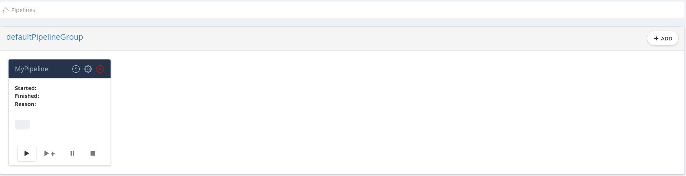

## Configuration

### Create a Pipeline

To create a pipeline, we must first understand the Continuous Delivery methodology/process.  

What is Continuous Delivery and why do we use it? 

[useful links or our explanation] 

The core idea of Continuous Delivery is to create a repeatable, reliable and incrementally improving process for taking software from concept to customer. The Continuous Delivery pipeline is what makes it all happen.

What is a Continuous Delivery Pipeline?

The continuous delivery pipeline breaks down the software delivery process into stages. Each stage is aimed at verifying the quality of new features from a different angle to validate the new functionality and prevent errors from affecting your users.    TO BE explained in details.... about stages, jobs tasks and accompanied materials.

 

Creating Pipeline

Creating a pipeline in HawkCD is very easy and its separated in few simple steps.
We'll explain it in details shortly.  
Before creating a pipeline we must first choose the pipeline group in which we want our pipeline to be created. 
In order to create a pipeline, we must have a pipeline group. That is why HawkCD comes with 
a <b> defaultPipelineGroup</b>.  

What are pipline groups? Click <a href="#"> here </a> to find out.

 This is how pipeline groups look like. 

HawkCD comes with a <b>defaultPipelineGroup</b>.
You can use the <b>defaultPipelineGroup</b> to create your first pipeline or you can
create your own pipeline group and delete <b>defaultPipelineGroup</b>.  
<b>NOTE: A pipeline group must be empty in order to be deleted.</b>

Here are the few simple steps to create your own pipeline.

<b>Step 1: Specify pipeline name</b>  
<i>Click <b>+Add</b> to create a new Pipeline Definition within the pipeline group you've chosen. </i>

This will open a pop-up window. 
<i>Enter pipeline name by your choice and click <b>continue</b></i>

<b>Step 2: Choose material source</b> 
Specify your material and click <b>continue</b>. You have two options - to choose an existing material or to add a new one. 

In the following example we demonstrate creating pipeline definition with a new material.
  So choosing <b>New Material</b> would be the right step.

<b> Step 3: Add material.</b>

In order to continue you have to fill out correctly two required fields: <b> Material Name</b> and <b>Git Url</b>. 
Unspecified <b>Git Branch</b> will choose <b>master</b> branch by default.
Marking <b>Poll for changes</b> will automatically fetch any new changes on your github repository.
(<b>NOTE:</b> in order for <b>Poll for changes</b> to work <a href="3"> Automatic scheduling</a> must be checked.)  

<b>Credentials</b> must be provided if the git repository is private, otherwise your material will be invalid and Pipeline 
run will be set to status FAILED.   (more about pipeline statuses <a href= "#"> here </a>)

<b> Step 4: Submit </b> 
Click <b> Submit </b> to save or <b> Back</b> to make some changes.

 
 

<h2>Your Pipeline is created successfully.</h2>

 

### Create Pipeline Group
#### TODO
### Monitor Pipeline run
### Add a new agent
### Setup resources
### Create & Authorize users
### Manage pipeline groups
### Configure Server
### Create materials
### Run multiple agents on a Server
### Running shell/bash and PowerShell scripts
### Uploading Artifacts
### Fetch Artifacts
### Fetch Materials
