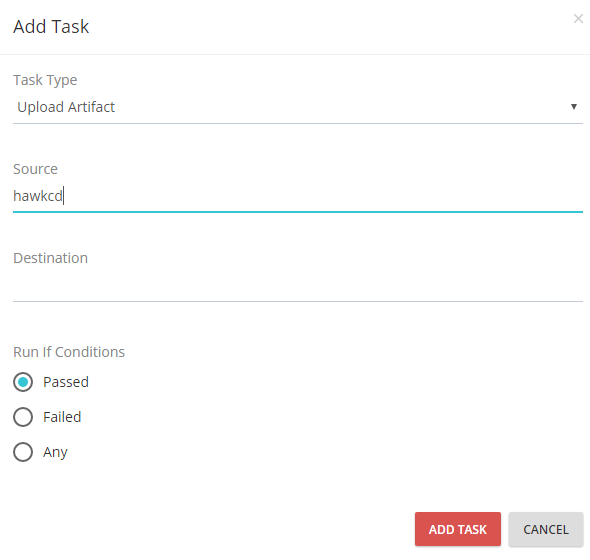

## Configuration

### Create a Pipeline
### Monitor Pipeline run
### Add a new agent
### Setup resources
### Create & Authorize users
### Manage pipeline groups
### Configure Server
### Create materials
### Run multiple agents on a Server
### Running shell/bash and PowerShell scripts
### Uploading Artifacts

The ability to re-use artifacts across various stages downstream of the pipeline is important aspect of a CD Pipeline. It requires to store them in a file share, ftp or artifacts repository. HawkCD allows you to store artifacts on the server directly and pull them on demand - whenever you need to be deployed. A common use case of the __Upload Artifacts__ task is when you do a build of you code base and would like to use the build output to deploy it to downstream enviroments e.g. Dev, Staging.

The server has built-in task called __Upload Artifacts__ that simplifies the process

To add __Upload Artifact__ Task to your pipeline you have to specify the job in which the task will operate. Once you do this, you can click the "**ADD TASK**" button and choose **Upload Artifact** from the dropdown field

#### How does it work ?

The __Source__ field points to the artifact that will be uploaded to the server, the __Destination__ folder points to directory on the server where the artifacts will be stored.

#### How to figure the agent sandbox folder?
The root folder of the agent is wherever it's been installed, however the agent pipelines sandbox is defined as follows:

In the Agent installation directory there is a folder called Pipelines where all the pipelines that have been run on the particular agents will be created

  If you have a Pipeline named Foo, and you want to upload artifacts that are in the root of the agent sandbox i.e. <InstallDir>/Pipelines/Foo/. you would need to leave the Source and Destinations folders empty

If the Destination field is left blank, the artifact will be stored in its Default Directory on the Server.

    ***Default Directory***

        Server root folder

            +Artifacts

                +Pipeline_name

                    +Pipeline_run

        in other words: Server/Artifacts/Pipeline_name/Pipeline_run/

    ***Example:*** If your Pipeline name is **HawkCD** and you are currently on your fifth run of the pipeline, the **Default Directory** will be: Server/Artifacts/HawkCD/5/

### Fetch Artifacts

>Fetch Artifact Task allows you to transfer Artifacts from The Server to the Agent

* The Pipeline dropdown specifies the source pipeline folder

* The Pipeline Run dropdown specifies the source pipeline run folder

* The Source field points to the Artifact itself.

      **Important** If during the Upload Artifact process you have specify destination, you have to include it in the Source as well

      **Example:** The directory to your already Uploaded Artefact is: Server/Artifacts/HawkCD/5/hawkcd/hawk.zip

        You have to fill the fields in the following way:

          1. Pipeline dropdown > Choose HawkCD

          2. Pipeline Run > Choose 5

          3. Source > Fill hawkcd/hawk.zip

      * If you have not specified destination folder during the process of addition Upload Artifact task, the artifact is placed in: Server/Artifacts/HawkCD/5/hawk.zip

            In this occasion you have to fill the fields in the following way:

              1. Pipeline dropdown > Choose HawkCD

              2. Pipeline Run > Choose 5

              3. Source > Fill hawk.zip
### Fetch Materials
