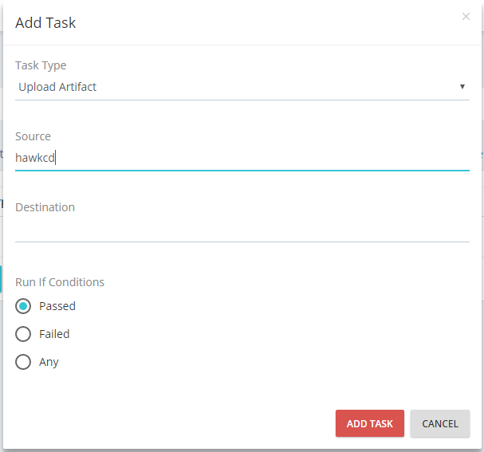

## Configuration

### Create a Pipeline
### Monitor Pipeline run
### Add a new agent
### Setup resources
### Create & Authorize users
### Manage pipeline groups
### Configure Server
### Create materials
### Run multiple agents on a Server
### Running shell/bash and PowerShell scripts
### Uploading Artifacts

>Uploading Artifacts Task allows you to transfer artifacts from the Agent to the Server.

To add Upload Artifact Task you have to specify the job in which the task will operate. Once you do this, you can click the "**ADD TASK**" button and choose **Upload Artifact** from the dropdown field

* The Source field points to the artifact that will be uploaded. The directory in which this artifact has to be placed is as follows

        Agent root folder

            +Pipelines

              +Pipeline name folder

        in other words: Agent/Pipleines/Pipeline_name/

    ***Example:*** If your Pipeline name is **HawkCD**, the artifact directory is: Agent/Pipelines/HawkCD/. So, in order for uploading to be successful, the artifact should be placed in this particular directory.

* The Destination field points to the place where this artifact will be uploaded

    + If left blank, the artifact will be stored in its Default Directory on the Server.

    + If filled, the artifact will be stored in a folder within the Default Directory.

    ***Default Directory***

        Server root folder

            +Artifacts

                +Pipeline_name

                    +Pipeline_run

        in other words: Server/Artifacts/Pipeline_name/Pipeline_run/

    ***Example:*** If your Pipeline name is **HawkCD** and you are currently on your fifth run of the pipeline, the **Default Directory** will be: Server/Artifacts/HawkCD/5/

### Fetch Artifacts

>Fetch Artifact Task allows you to transfer Artifacts from The Server to the Agent

* The Pipeline dropdown specifies the source pipeline folder

* The Pipeline Run dropdown specifies the source pipeline run folder

* The Source field points to the Artifact itself.

      **Important** If during the Upload Artifact process you have specify destination, you have to include it in the Source as well

      **Example:** The directory to your already Uploaded Artefact is: Server/Artifacts/HawkCD/5/hawkcd/hawk.zip

        You have to fill the fields in the following way:

          1. Pipeline dropdown > Choose HawkCD

          2. Pipeline Run > Choose 5

          3. Source > Fill hawkcd/hawk.zip

      * If you have not specified destination folder during the process of addition Upload Artifact task, the artifact is placed in: Server/Artifacts/HawkCD/5/hawk.zip

            In this occasion you have to fill the fields in the following way:

              1. Pipeline dropdown > Choose HawkCD

              2. Pipeline Run > Choose 5

              3. Source > Fill hawk.zip
### Fetch Materials
