# Deployment of a Pipeline
## Create a Pipeline
### # 1: Specify pipeline name
Click <b><i>+Add</i></b> 
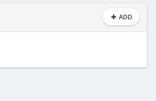
 
 

This will open a pop-up window. 
Enter pipeline name by your choice and click <b><i>Continue</i></b>
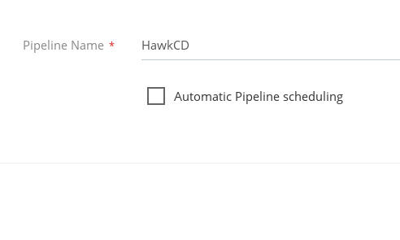
 
 

### # 2: Choose material source
Specify your material and click <b><i>Continue</i></b>. 
You have two options:

> * Existing Material - (choose material from..)
> * New Material - (adds new material from to..)

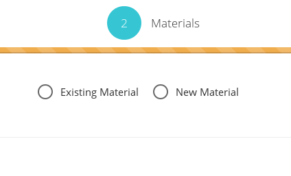
 Choose <b><i>New Material</i></b>
 
 

### # 3: Add material

In order to continue you have to fill out correctly two required fields: <b> Material Name</b> and <b>Git Url</b>. 
Unspecified <b>Git Branch</b> will choose <b>master</b> branch by default.
Marking <b>Poll for changes</b> will automatically fetch any new changes on your github repository. 

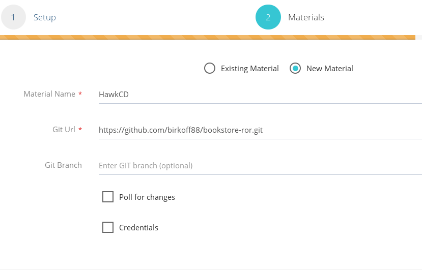
<b>CAUTION:</b> In order for <b>Poll for changes</b> to work <a href="3"> Automatic scheduling</a> must be checked. 
<b>Credentials</b> must be provided only if the git repository is private.

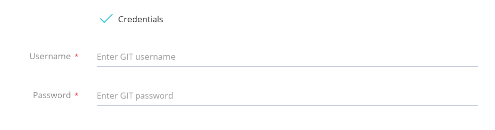
 

### # 4: Submit
Click <b> Submit </b> to save or <b> Back</b> to make changes.

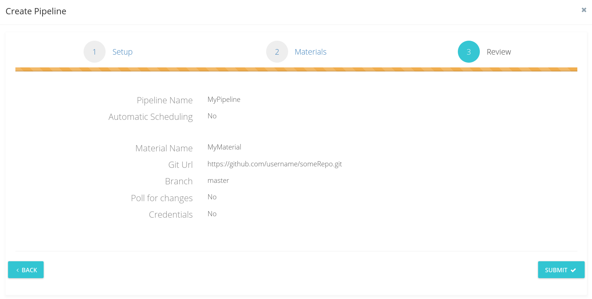

 
 

<h2>Your Pipeline is created successfully.</h2>

 
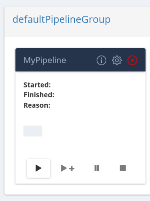

## Configure Pipeline
### Update Pipeline Name
To update Pipeline name simply click the 'config' button (the one in the middle).

This will open the config screen, General Options tab is selected by default.  
Enter the new name and select <b> Update </b> 
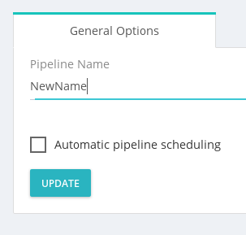
 

<b>DONE ! </b> 
Pipeline name changed. 

 
 
 

### Automatic Scheduling
### Add / Delete Stage
#### Configure Stage

### Add / Delete Job
Choose Pipeline you wish to add Job to and click *config* button (the one in the middle).
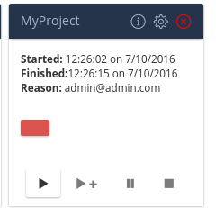    
Navigate to the Stage you wish to add Job to.
Jobs tab is selected by default.  click <strong>*Add Job*</strong>.
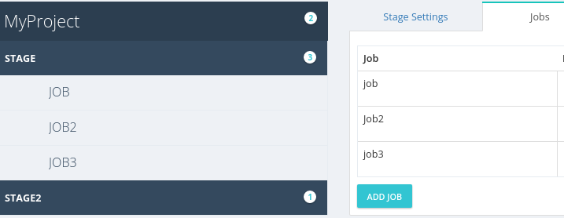    

Enter Job name, select job's task, fill task's form template add click <strong>*Add Job*</strong>.
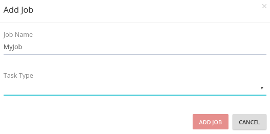    

Done!  
*MyJob added*.  
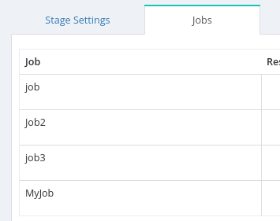    

##### Delete Job
Choose Pipeline where to delete Job from and click *config* button (the one in the middle).
    

Navigate to Stage where the Job is placed and click *Delete*.
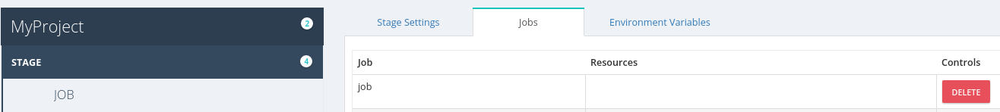    

Confirm removal by clicking *Delete* button.
    
    

Navigate to the [Job](/) to which you want to add [Task](/)  
*Tasks* tab is selected by default. Click on *Add Task*. 
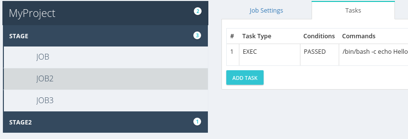    

Choose *Exec* on the *Task Type*, fill out the form and click *Add Task*.  
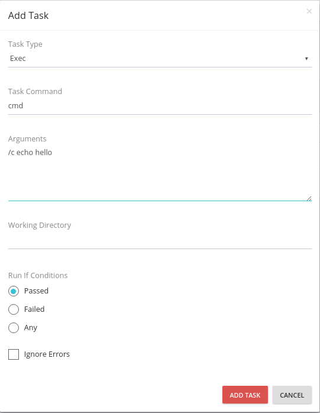    

<strong> DONE! </strong>  
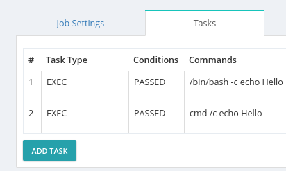    

##### # Delete Exec Task

Navigate to the [Job](/concepts/#job) from where you want to delete the [Task](/concepts/#task)  
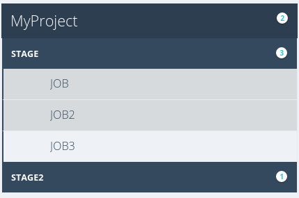    

Click *Delete* to remove selected task. 

##### Configure Exec Task

There are two options that can be configured on *Exec Task*.
 
 

First, navigate to selected [Job](/concepts/#job) and click *Edit* on the [Task](/concepts/#task)  to configure. 
    

Configure the desired behavior for your [Task](/concepts/#task) and click *Edit Task*.    
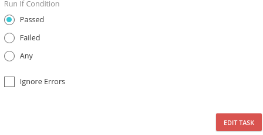    

#### Add / Delete Upload Artifact
##### Configure Upload Artifact
#### Add / Delete Fetch Artifact Task
##### Configure Fetch Artifact Task
#### Add / Delete Fetch Material Task

## Delete Pipeline

# Pipeline Groups
## Add new Pipeline Group
### Steps
## Manage Pipeline Group
### Steps
## Delete Pipeline Group
### Steps
# Materials
## Add new Material
### Steps
## Manage Material
### Steps
## Delete Material
### Steps
