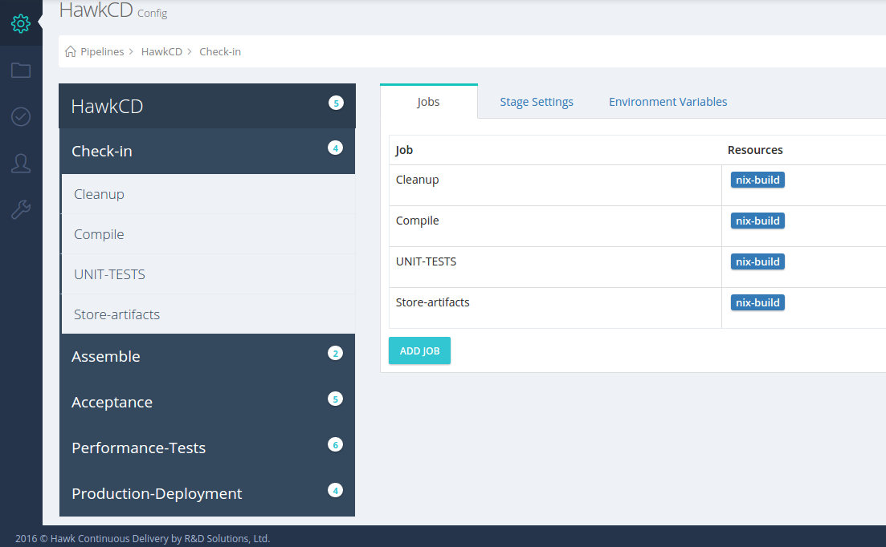

Configure HawkCD
==================

Set-up a Pipeline
-----------------

### Steps by Step

* Chose a Pipeline Group
* In the right top corner click "Add" button
* Fill in ``Pipeline Name`` and press ``Continue``
* Choose either existing or create a new material
* Review your pipeline definition settings and press the ``Submit`` button

Note

  For complete configuration of the pipeline definition navigate to the pipeline config screen where additional jobs and stages can be created to suit your deployment process

Pipeline Configuration
-----------------------

Once a ``pipeline`` is created additional configuration is required to get it building and deploying your code. The default pipeline wizard creates a ``pipeline definition`` with default ``stage``, ``job`` and one ``task``.

Here's an example pipeline that can be developed with HawkCD:

Pipeline Name:HawkCD

Stages:

* Check-in    
* Assemble    
* Acceptance
* Performance
* Production Deployment

#### Configuration Options

* ``Automatic pipeline scheduling`` - when set to true, the pipeline is triggered when material changes e.g. a new commit is pushed to the remote repository

Running a Pipeline
--------------------

Manage Pipeline Groups
----------------------

Pipeline Groups allows grouping pipelines together.

### Add new Pipeline Group

* Go to the Admin Screen
* Select ``Pipeline Groups`` and press the ``Add`` button
* Fill in the group name and press ``OK`` button

### Delete Pipeline Group

* Go to the Admin Screen
* Select ``Pipeline Groups`` choose a group
* Press the bin button in the right corner of the group

WARNING

A Pipeline group can be deleted in case it doesn't have any any pipelines assigned to it, otherwise the delete button will be unavailable

### Assign pipeline to a group
* Go to the Admin Screen
* Select ``Pipeline Groups`` and choose a concrete group
* Press the ``assign pipeline`` button
* A pop-up window will show all ``assigned`` and ``unassigned`` pipelines to choose from
* Select a pipeline and press the ``OK`` button

Manage Materials
----------------
Materials represent ``code`` (git)  and ``artifact`` (NuGet) repositories. For every pipeline there should be at least one material defined.

### Add a new material

* Go to the Admin Screen
* Select ``Materials`` section
* Press the ``Add`` button
* Fill in the ``Material Name``, ``Git Url`` and  ``Branch``
* Fill in the ``Credentials`` details if the material is private git repository

Note

  At the moment HawkCD supports only materials of type git, but future versions will provide support for other types of materials

### Update an Existing Material

* Go to the Admin Screen
* Select ``Materials`` section
* Press the ``edit`` button
* Update the Material's fields and press ``OK``

Manage Users & Groups
---------------------
HawkCD allows managing users and groups with ease.

### Add a User Group

* Go to the Admin Screen
* Select ``User Groups`` menu
* Press ``Add`` button
* Fill in the group name and click ``OK``

### Manage user group permissions

* Go to the Admin Screen
* Select ``User Groups`` menu
* Choose a ``User Group`` by clicking the ``cog`` button
* From the pop-up window ``add/update/delete``  ``scope`` and ``permissions`` for the group

### Assign/Remove users to/from a group

* Go to the Admin Screen
* Select ``User Groups`` menu
* Expand a group and press the ``manage`` button
* Select a user to be assigned to the group
* Press the ``OK`` Button

### Delete a User Group
* Go to the Admin Screen
* Select ``User Groups`` menu
* Click the ``bin`` icon from the header of the group
* Confirm the action by pressing ``ok`` button

WARNING

  Deleting a user group is possible if it doesn't have any users assigned to it

### Create a new user

* Go to the Admin Screen
* Select ``Users`` menu
* Press the ``Add`` button
* Enter user's email and password
* Press the ``OK`` button

### Edit User
* Go to the Admin Screen
* Select ``Users`` menu
* Press the ``cog`` button

Note

  At the moment HawkCD supports only resetting user password and changing email

### Manage permissions for user

* Go to the Admin Screen
* Select ``Users`` menu
* Choose a ``User`` by clicking the ``manage`` button
* From the pop-up window ``add/update/delete``  ``scope`` and ``permissions`` for the user

Note

  Note that if the user has any inherited permissions from a group it participate in, they will be overwritten.

### Enable/Disable Users

* Go to the Admin Screen
* Select ``Users`` menu
* Press the ``enable/disable`` button for concrete user

Note

  Disabled users will no longer be able to access (login) to the system

Manage My Profile
---------------

The logged in user into the server is allowed to change his password

Agents Management
-----------------

``HawkCD`` [Agents](/concepts/#agent) are the workers that execute Jobs/Tasks.

### Enable/Disable Agent

* Go to the Agents screen
* Press the ``enable/disable`` toggle button

Note

  When an agent connects to the server for first time it is disabled, it requires server administrator to enable it -  becomes available for job

### Add/Remove agent resources

* Go to the Agents screen
* Press the ``edit resources`` button
* ``Add/Update/Delete`` agent [resources](/concepts/#resource-tags)

Note

  Resources are used to route jobs to agents

Artifacts Repository
--------------------

### Download Artifacts
