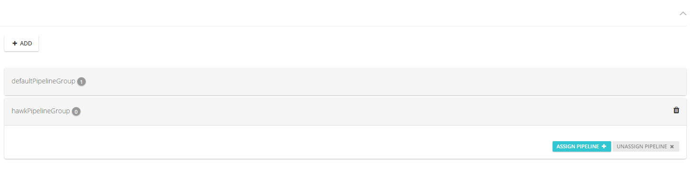
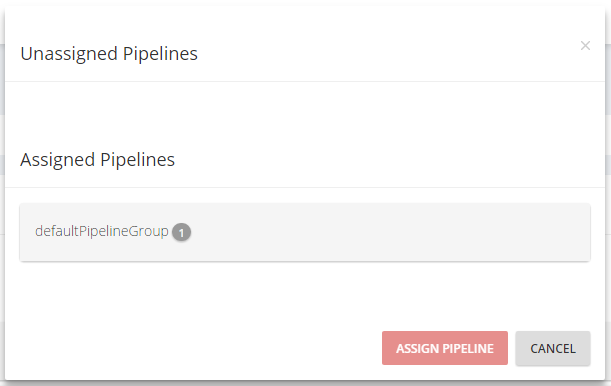
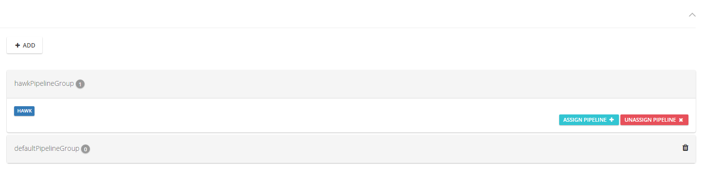
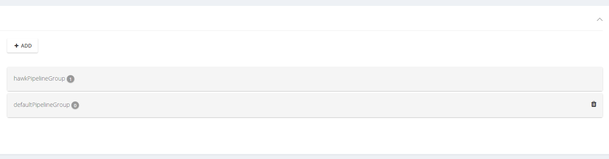

## Configuration

### Create a Pipeline

Once you have logged into the system, you will be redirected to the page which displays all the Pipelines you have permission for. Additionally, if you have permission for adding Pipelines, there will be "Add" button within each Pipeline Group, which will open modal window, where the process of creation will begin.

 

#### The creation of Pipeline can be accomplished in 3 basic steps:

>Step 1: Setup

 

###### * In this example **Automatic Scheduling** will be used

 1. *Fill in the Pipeline name*

 2. *Choose whether the pipeline will be automatically scheduled (this means that if the material that the pipeline uses is polling for changes, each time there is a registered change in the material, the pipeline will automatically run)*

>Step 2: Materials

 

 In this step you can use either ***Existing Material***, or ***New Material***, which the pipeline will use. If you choose the first option, a dropdown list with all the materials will be provided for you and you will be able to choose any one of them.

###### * In this example **New Material** will be used

###### * In this example **Poll for changes** will be used

1. *Fill the material name*

2. *Fill the git repo url*

3. *Choose whether the material will be polling for changes (this means that if the pipeline that uses the material is set to automatically schedule, each time there is a registered change in the material, the pipeline will automatically run)*

4. *Choose whether you will enter your git credentials (username and password). In the cases when the git repo is private, the credentials are obligatory, while when it is public, they are not*

>Step 3: Review

Here, you can review the pipeline you just created and if everything is correct, to submit the Pipeline

### Manage Pipeline run
### Add a new agent
### Setup resources
### Create & Authorize users
### Manage  pipeline groups

>*Pipeline Group is logical container for pipelines, created with the sole purpose for separation of pipelines.*

In order to manage the pipeline groups which you operate within, navigate to Administration Section of the menu, and choose Pipeline groups.

From here, there are several options for you to continue:

1. *Create new Pipeline Group*

    In order to create new **Pipeline Group**, click the "**ADD**" button at the top of the page.

    Once clicked, a modal window pops up, where you have to option to write down the name of the new Pipeline Group and proceed with the creation process.

    

2. *Manage Pipelines within certain Pipeline Group*

    There are two options for managing Pipelines within Pipeline Group:

      + Assign Pipeline

          In order to assign Pipeline to Pipeline Group, click on the Pipeline Group you want to operate with and then click on "**АSSIGN PIPELINE**" button.

          

          Once done, a modal window will appear on the screen. There you can choose from all Unassigned Pipelines or the ones that are within other Pipeline Groups. As soon as you spot the desired pipeline, click on it to mark it for assignment.  If done, click on "**ASSIGN PIPELINE**" to finalize the process.

          

      + Unassign Pipeline

          In order to Unassign Pipeline from Pipeline Group, first you select the pipeline group, then you click on the pipeline you want to unassign, and finally click on the aleary clickable button "**UNASISIGN PIPELINE**"

          

3. *Delete Pipeline Group*

    In order to delete a Pipeline Group, it should be empty. Only then, the button in the form of trash bin will appear and you will be able to delete the desire Pipeline Group.

    
### Configure Server
